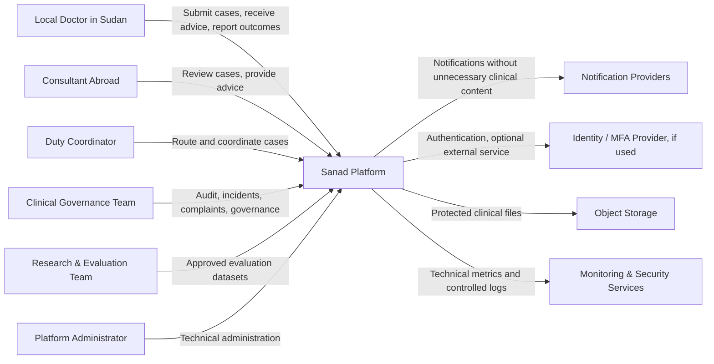
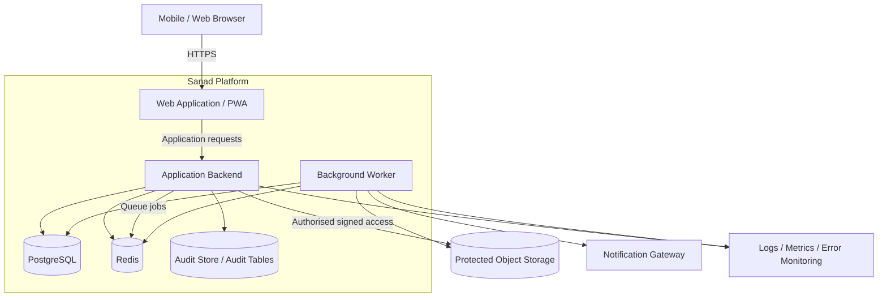

# Sanad C4 Architecture, Draft

**Version:** 0.1  
**Status:** Candidate architecture, not yet approved  
**Scope:** Custom MVP option for the initial pilot

## 1. Important Boundary

This document describes what a custom Sanad MVP could look like if the team decides to build or substantially own the platform.

It does **not** mean that the Build vs Buy vs Partner decision has already been made.

If the team adopts an existing telemedicine platform, this document becomes a reference architecture for evaluating whether that platform can satisfy Sanad's clinical, privacy, security, and operational needs.

## 2. Architectural Goals

The candidate architecture should support:

- low and intermittent connectivity;
- mobile-first use;
- Arabic and English;
- clinical images and documents;
- strong role and contextual access control;
- complete auditability of material actions;
- data minimisation;
- clear clinical workflow states;
- asynchronous specialist review;
- future integration without premature complexity;
- safe evolution from pilot to a larger service.

## 3. Architecture Style

Recommended MVP style:

**Modular Monolith**

Rationale:

- the pilot scale is small;
- product and clinical rules are still evolving;
- operational simplicity is important;
- a single deployable application reduces infrastructure burden;
- domain boundaries can still be enforced in code;
- modules can later be extracted if scale or organisational ownership justifies it.

Microservices are not recommended as the starting architecture.

## 4. System Context



## 5. Context Responsibilities

### Sanad Platform
System of record for the tele-expertise workflow.

Responsibilities include:

- professional identity and verification status;
- case lifecycle;
- routing;
- consultant advice;
- outcomes;
- clinical-governance workflows;
- audit trail;
- controlled reporting.

### Notification Providers
Used only for service notifications approved by privacy and security review.

Notifications should not contain unnecessary clinical information.

### Object Storage
Stores authorised clinical files and images separately from the relational database.

### Monitoring and Security Services
Receive technical metrics, errors, and security events.

They should not receive full clinical payloads.

## 6. Container View



## 7. Candidate Containers

### Web Application / PWA

Responsibilities:

- Arabic and English user interface;
- mobile-first interaction;
- case drafting;
- safe local draft behaviour;
- upload initiation;
- workflow status display;
- synchronisation feedback.

Candidate implementation:

- Vue 3
- TypeScript
- Inertia or a clean API-driven boundary where justified
- Service Worker / PWA capabilities

The offline model remains subject to ADR approval.

### Application Backend

Responsibilities:

- authentication orchestration;
- authorisation;
- professional verification;
- case rules;
- routing;
- advice workflow;
- outcomes;
- governance;
- audit events;
- reporting;
- API and integration boundaries.

Candidate implementation:

- Laravel

### Background Worker

Responsibilities:

- notifications;
- image/file processing where clinically approved;
- asynchronous exports;
- scheduled SLA checks;
- controlled reporting tasks;
- cleanup jobs.

### PostgreSQL

System of record for structured application data.

Expected data areas:

- identities and profiles;
- facilities;
- verification state;
- clinical case metadata and structured content;
- assignments;
- advice;
- outcomes;
- governance records;
- configuration.

### Redis

Candidate uses:

- job queues;
- cache;
- rate-limiting support;
- ephemeral coordination.

Redis must not become the durable source of clinical truth.

### Object Storage

Stores:

- approved clinical images;
- test-result documents;
- governance attachments where permitted.

Requirements:

- private by default;
- no public buckets;
- short-lived authorised access;
- encryption;
- malware/file validation where appropriate;
- metadata policy;
- retention controls.

### Audit Store

For MVP, this may be implemented within PostgreSQL using append-oriented audit tables rather than a separate physical service.

It should record material actions without duplicating excessive clinical content.

## 8. Proposed Application Modules

```text
Identity
ProfessionalVerification
Facilities
ClinicalCases
CaseTemplates
Routing
ConsultantAvailability
ClinicalAdvice
Outcomes
ClinicalGovernance
Incidents
Complaints
SecondOpinions
Notifications
Audit
Reporting
Administration
```

Modules should communicate through explicit application interfaces rather than uncontrolled cross-module data access.

## 9. Clinical Case Aggregate

A case is likely to be the central business aggregate.

Potential related entities:

```text
ClinicalCase
├── CaseTemplateVersion
├── CaseSubmission
├── Attachments
├── AssignmentHistory
├── InformationRequests
├── Advice
├── AdviceAddenda
├── Outcome
├── SecondOpinions
└── AuditReferences
```

Incidents and complaints should reference cases where appropriate but remain separate governance aggregates.

## 10. State Machine

Proposed normal lifecycle:

```text
Draft
  ↓
Submitted
  ↓
Awaiting Assignment
  ↓
Assigned
  ↓
Under Review
  ↓
Advice Provided
  ↓
Awaiting Outcome
  ↓
Closed
```

Supporting transitions may include:

- Awaiting Additional Information
- Reassigned
- Withdrawn
- Escalated
- Second Opinion Requested
- Reopened

The exact state machine must follow the validated Clinical Workflow Specification.

## 11. Authentication

The architecture should support:

- secure credential authentication;
- multi-factor authentication;
- privileged-role protection;
- account recovery;
- session control;
- later federation through OIDC/SSO if required.

For the pilot, external enterprise identity infrastructure should not be introduced unless it materially improves security or partner integration.

## 12. Authorisation

RBAC alone may not be sufficient.

Example:

Two users can both have the Consultant role, but one consultant should not automatically see the other's assigned cases.

Therefore access decisions should combine:

- role;
- case relationship;
- facility;
- assignment;
- governance authority;
- record sensitivity.

This is effectively contextual authorisation on top of RBAC.

## 13. Offline Architecture

Three candidate levels should be assessed.

### Level 1: Online application with resilient drafts
Minimal offline capability.

### Level 2: PWA offline draft queue
Selected structured draft data stored locally and synchronised later.

### Level 3: Full offline clinical workflow
Substantial local clinical data and attachments available without connectivity.

**Initial recommendation:** Prefer Level 2 unless field evidence proves that Level 3 is necessary.

Full offline capability increases:

- lost-device exposure;
- synchronisation complexity;
- conflict handling;
- local encryption requirements;
- deletion complexity;
- incident-response scope.

## 14. Synchronisation Principles

If offline drafts are implemented:

- every local draft has a client-generated identifier;
- server assignment of permanent case ID occurs on accepted submission;
- users can see sync status;
- retries are idempotent;
- duplicate submission is prevented;
- conflicts are surfaced rather than silently overwritten;
- local data expires or is removed after successful synchronisation according to policy.

## 15. File Upload Architecture

For weak connectivity, large uploads should support:

- compression where clinically safe;
- resumable or multipart upload where practical;
- retry;
- visible upload status;
- file-type validation;
- secure pre-signed upload/download flows;
- post-upload verification.

Diagnostic integrity must not be sacrificed merely to reduce file size.

## 16. Notification Architecture

Notifications should reference the existence of an event rather than exposing case content.

Example:

Preferred:
> A priority case has been assigned to you.

Avoid:
> Patient X with condition Y is awaiting your review.

Channel selection remains TBD.

## 17. Reporting Architecture

Operational dashboards should query controlled reporting views.

Research data extraction should be separated from ordinary administrator access.

Future options may include:

- read replicas;
- pseudonymised research datasets;
- scheduled approved exports;
- analytics warehouse.

These are not required for the initial pilot unless evaluation needs justify them.

## 18. Deployment Model

Candidate MVP deployment:

```text
Internet / approved network path
          ↓
Reverse Proxy / WAF
          ↓
Application Containers
     ↙          ↘
PostgreSQL     Redis
     ↓
Encrypted Backups

Application → Private Object Storage
Application → Controlled Monitoring
```

Specific cloud provider and region remain TBD pending data-residency and legal decisions.

## 19. Availability

The founding service is not an emergency service.

The infrastructure should still be reliable, but architecture targets should reflect the clinical service model rather than pretending to provide emergency-grade 24/7 guarantees.

The team should define:

- target uptime;
- planned maintenance;
- recovery time objective;
- recovery point objective;
- outage communication;
- fallback clinical workflow.

## 20. Backup and Recovery

Minimum capabilities:

- encrypted database backups;
- object-storage durability and versioning policy;
- restoration testing;
- documented recovery process;
- access controls;
- retention aligned with privacy policy.

## 21. Observability

Monitor:

- application errors;
- job failures;
- upload failures;
- queue delay;
- response latency;
- database health;
- storage failures;
- security events;
- SLA-processing failures.

Do not send unrestricted clinical content to monitoring vendors.

## 22. Interoperability

The MVP should avoid premature integration complexity.

Potential future standards may include healthcare interoperability approaches such as FHIR, but adoption should be driven by actual partner or policy requirements.

The system should first maintain a clean internal domain model and stable integration boundaries.

## 23. Scale Path

### Pilot
Modular monolith, single primary database, object storage, queue workers.

### Expansion
Scale application instances horizontally, improve queues, reporting, storage, and deployment resilience.

### Larger multi-region / national service
Only where evidence requires:

- dedicated integration services;
- separated analytics pipeline;
- external identity federation;
- specialised audit/security pipeline;
- domain extraction into separate services.

Microservices should be a response to proven organisational or technical constraints, not a maturity badge.

## 24. Candidate Technology Stack

Subject to ADR approval:

- Laravel
- Vue 3
- TypeScript
- PostgreSQL
- Redis
- S3-compatible object storage
- Docker
- CI/CD pipeline
- controlled error monitoring and observability

## 25. Architecture Decisions Required

Before implementation:

1. Build vs Buy vs Partner
2. Hosting provider and region
3. Data residency
4. Offline level
5. Authentication and MFA
6. Contextual authorisation model
7. Object-storage architecture
8. Image-processing rules
9. Notification providers
10. Monitoring stack
11. Backup and disaster-recovery targets
12. Research-data extraction model
13. Native mobile vs PWA threshold
14. Interoperability commitments

## 26. Next Architecture Artifact

The next decision artifact should be:

**Build vs Buy vs Partner Assessment / ADR-001**

It should compare the custom architecture above against suitable existing telemedicine platforms using Sanad's actual clinical, connectivity, security, privacy, governance, and cost requirements.

---

### Project & Documentation Attribution

**Project Founder and Founding Prospectus source:** **Dr. Elaf Sabri Khalil**  
[Email](mailto:elafsabri515@gmail.com) · [LinkedIn](https://www.linkedin.com/in/elaf-sabri-khalil-68097024a)

**Consulting contributor — repository structure, documentation architecture, methodology expression, and analysis:** **Alfatih Abdalla**  
[Email](mailto:Fabdalla782@gmail.com) · [LinkedIn](https://www.linkedin.com/in/alfatihabdalla) · [GitHub](https://github.com/fatihg80)

Alfatih Abdalla contributed to Sanad in a consulting capacity after being engaged by Dr. Elaf Sabri Khalil. His contribution in this repository is limited to structuring the repository, documentation layers, analysis, and related consulting work based on Dr. Elaf’s founding materials. This attribution does **not** represent Alfatih Abdalla as the founder or owner of Sanad.

Source materials and third-party contributions retain their respective authorship and rights.
